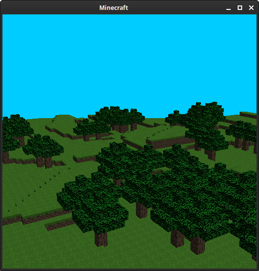
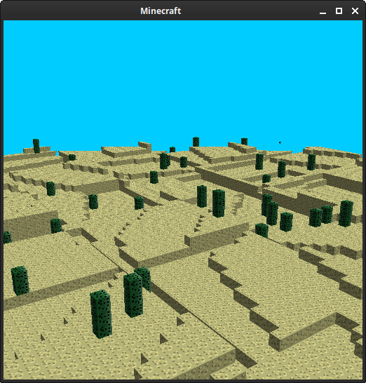

RELEASE V1.0
------------
- Added desert biome
- Added sand and cactus block
- Bottom of the chunks can be seen once you go below -16y now
- Different biomes can be spawned all over the world
- Emerald blocks can actually be spawned now
- Changed ore spawn rate
- Player can place multiple blocks now (using number keys 1-8)
- Custom SFX added, each block now has their own corresponding sound effect (some of them are really bad though, forgive me)

It's finally finished! After 5 months of hard work, the game has hit its first release. There are still a lot of things that would improve this, but for now I think I'll keep this as it is right now. I probably won't give this any major updates anymore, but minor patches will still be applied every so often. 

For building the program, refer to the documentation.

FEATURES
--------
- Procedurally generated world
- Up to 3 different biomes (plains, forest, desert)
- Many different ore blocks can be found underground (almost all of the same ones in Minecraft)
- Destroy blocks and place them, with up to 8 different blocks that can be picked and placed
- Unique sound effects that are distinctly different from the original game (and textures too!)

TO BE RESOLVED
--------------
- Blocks are still highlighted even when the player has stopped looking at them
- Program consumes too much memory as more chunks are created

LIBRARIES/TOOLS/PROGRAMS USED
-----------------------------
https://www.glfw.org/ (Window and event handling library) 
https://github.com/Dav1dde/glad (Provides OpenGL loader generator, and more.) 
https://github.com/SFML/SFML (I use it for audio, but they support graphics, networks, and a whole lot of other stuff) 
https://github.com/kthohr/gcem (Compile-time math library) 
https://github.com/nothings/stb (For image processing) 
https://sfbgames.itch.io/chiptone (Created the sound effects using this) 

I'm also using other tools to help make the code look cleaner, and hopefully 'safer'. Hope you find them interesting:
https://github.com/danmar/cppcheck 
https://clang.llvm.org/extra/clang-tidy/ 
https://drmemory.org/index.html 
https://valgrind.org 

